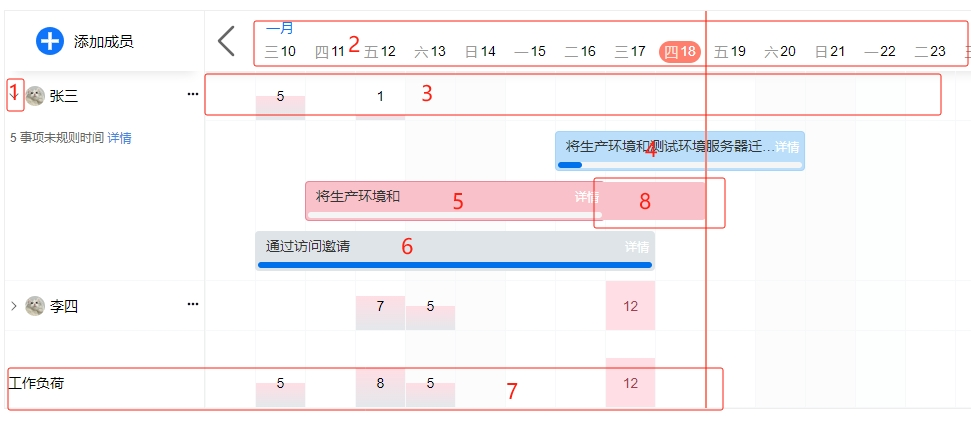
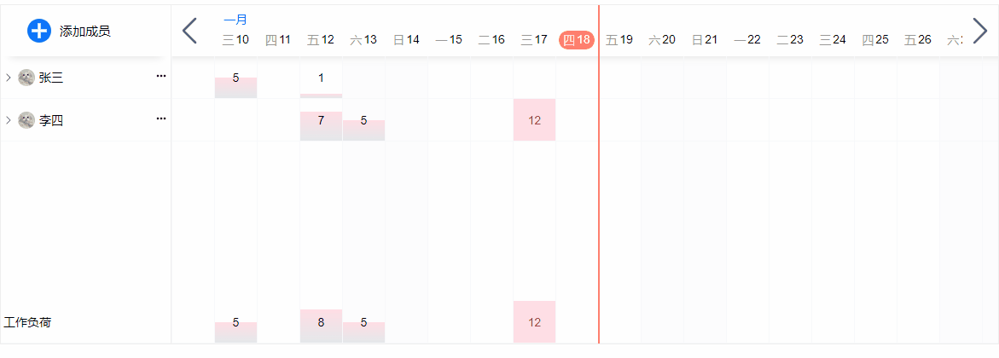

# ak-gantt-charts甘特任务负荷进度管理图

一款纯js开发的功能强大的项目管理工具，它能够帮助团队更好地管理和跟踪任务的进度，提高团队协作效率。该组件提供了一个直观的甘特图，展示任务的时间线和进度，并支持多人协作编辑，实时同步任务状态，可自动统计组内成员在一定周期范围内同时进行的事项数，并在日历中展示事项安排，帮助部门负责人统一查看对比成员的工作量和工作安排。通过直观展示成员工作饱和度，管理者能清晰认识到成员的工作负载与工作效率，及时进行调整与推进。

- 日期时间轴支持鼠标滚动进行缩放
- 展示区域可左右拖动选择日期范围，可无限延伸
- 支持拖动任务详情更新开始和结束时间
- 支持查看任务详情
- 未按时完成任务支持自动延伸

## 演示地址

https://337547038.github.io/ak-gantt-charts/#/

## 说明



1.展开收起详情，可查看当前需处理事项数及各任务详情

2.时间轴，可滚动鼠标左右滑动无限延伸日期

3.当前成员每天工作负荷，数字越大表示当天负荷越重

4.正常任务，可直接显示任务开始和结束时间。点击任务条可左右拖动改变时间

5.超时任务，表示结束时间已过去，但还没完成，侧自动延伸到当天

6.已完成的任务

7.所有成员的对应时间的任务负荷量

8.超时任务，自动延伸部分



## 安装使用

```shell
npm install ak-gantt-charts
```

```vue
<script setup>
import akGanttCharts from 'ak-gantt-charts'
import 'ak-gantt-charts/style.css'  //　引入组件样式
const data = [
  {
    name: '张三',  //显示的会员名称
    face: '/face.webp', // 会员头像
    todo: 5, // 未规划的事项数
    progress: {'2024-01-01': 5, '2024-01-02': 0, '2024-01-03': 12},// 当前时间范围里每天的工作负载
    list: [//任务详情
      {
        startDate: '2024-01-01', //开始时间
        endDate: '2024-01-05', //结束时间
        title: '将生产环境和测试环境服务器迁移到腾讯云', //任务名称
        progress: 30 // 当前进度
        //....
      },
    ]
  }]
</script>
<template>
  <ak-gantt-charts :data="data"/>
</template>
```

## props

| 参数         | 类型     | 说明            |
|------------|--------|---------------|
| data       | Array  | 展示所需数据        |
| width      | number | 每个单元格的宽       |
| offsetUnit | number | 初始偏移多少个单位即多少天 |

## 事件

| 参数               | 说明                    |
|------------------|-----------------------|
| getData          | 根据开始和结束时间加载数据         |
| getTaskDetail    | 展开时事件，可用于加载任务详情数据     |
| updateTaskDetail | 拖动任务详情时事件，用于更新保存拖动后的值 |
| otherEvent       | 其他事件                  |
